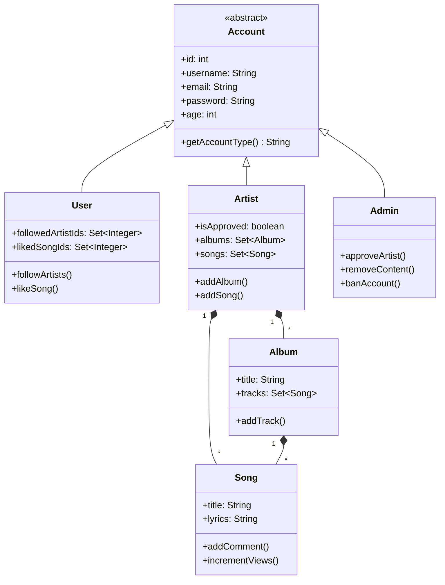

# 🎵 Retro Music - Lyrics & Music Platform

**Inspired by Genius**, Retro Music is a comprehensive Java Swing application that allows users to explore songs, lyrics, artists, and albums. It features three distinct user roles (User, Artist, Admin) with tailored functionalities for each.


---

## ✨ Features

### 👤 **For Users**

- Like/favorite songs
- Follow artists
- View artist profiles and albums
- Comment on songs
- Personal profile management

### 🎸 **For Artists**
- Create and manage albums
- Add songs with lyrics
- View follower count
- Track song popularity (views/likes)
- Artist profile customization

### ⚙️ **For Admins**
- Approve/reject artist registrations
- Moderate content (songs, albums)
- Ban/suspend accounts
- Comprehensive admin dashboard

---

## 🛠️ Technical Implementation

### 📚 Libraries Used
| Library                                       | Purpose |
|-----------------------------------------------|---------|
| **Java Swing**                                | Core GUI framework |
| **AWT**                                       | Basic windowing and graphics |
| **AtomicInteger**                             | atomically incremented counters |
| **Java Collections**                          | Data structures for in-memory storage |
| **Java Time (LocalDate/DateTime)**            | Date handling for releases/timestamps |
| **Base64 & SecretKeyFactory & PBEKeySpec & SecureRandom** | Password hashing/verification |

### 🔐 Security Implementation
- PBKDF2 password hashing with salt
- Account state management (active/banned/suspended)
- Authorization checks for all sensitive operations

---

## 🧗‍♂️ Project Challenges

### 1. **Complex Data Relationships**
- Managing bidirectional relationships between:
   - Artists and their songs/albums
   - Users and their liked/followed content
- Solution: Implemented careful collection synchronization

### 2. **Swing UI Limitations**
- Difficulty creating modern, responsive interfaces
- Workarounds:
   - Custom component styling
   - Manual layout management
   - Gradient painting for visual appeal

### 3. **State Management**
- Tracking:
   - User sessions
   - Content ownership
   - Approval workflows
- Solution: Centralized account system with role-based permissions

### 4. **Performance with Large Datasets**
- Linear searches in collections became slow
- Optimizations:
   - Cached frequently accessed data
   - Added indexed lookups

### 5. **Concurrency Issues**
- Shared collections caused thread safety concerns
- Implemented:
   - Concurrent collections
   - Synchronized critical sections

---

## 📂 Project Structure

```
org.App/
├── Account/            # Core account system
│   └── Account.java    # Base account class
├── Users/              # User type implementations
│   ├── User.java       # Regular user
│   ├── Artist.java     # Music artist
│   └── Admin.java      # Administrator
├── contents/           # Music content
│   ├── Song.java       # Song implementation
│   ├── Album.java      # Album system
│   └── Comment.java    # Comment system
└── utils/              # Utilities
    └── PasswordHasher.java  # Secure password handling
```

---

## 🏗️ System Architecture



---

## 🚀 Getting Started

### Prerequisites
- Java JDK 23+
- Gradle (for future build integration)

### Installation
1. Clone the repository:
   ```bash
   git clone git@github.com:MohammadDaeizadeh/Nowruz-Project.git
   ```
2. Compile and run:
   ```bash
   javac org/App/Main.java
   java org.App.Main
   ```

---


## 📈 Future Enhancements

- [ ] **Database Integration** (MySQL/PostgreSQL)
- [ ] **Retro Theme**
- [ ] **Audio Preview** functionality
- [ ] **Advanced Analytics** dashboard
- [ ] **Social Features** (playlists, sharing)

---

## 🤝 Contributing
**Developer:** Mohammad Daeizadeh \
**Course Mentor:** Danial Taghipour

---

## ✉️ Contact

**Email:** mohammad.daeizade@gmail.com

Project Link: [https://github.com/MohammadDaeizadeh/Nowruz-Project](https://github.com/MohammadDaeizadeh/Nowruz-Project)

---

🎶 **Happy Coding!** Keep the music playing...